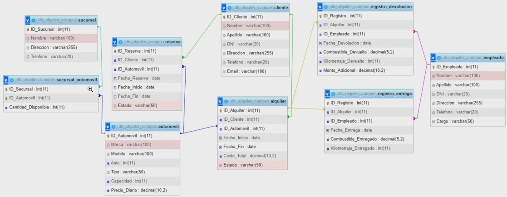

# Alquiler-Mongo

Este es un ejercicio de práctica para manipular y realizar consultas simulando una base de datos relacional con el siguiente esquema:



## Requisitos

Antes de comenzar, asegúrate de tener instalado lo siguiente en tu máquina:

- Node.js
- MongoDB: Base de datos NoSQL de código abierto, orientada a documentos y altamente escalable. Almacena datos en formato JSON y es ampliamente utilizado para aplicaciones web y móviles.

Además de esto, es necesario mencionar que los paquetes usados fueron las siguientes:

- cookie-parser: Para el manejo de las cookies al momento de realizar la autenticación respectiva en cada ruta necesaria.
- dotenv: Para usar variables de entorno.
- express: Para realizar el montaje del servidor y de la api como tal.
- jose: Para el uso del Json Web Token (JWT).
- mongodb: Para poder hacer una conexión a nuestra base de datos.
- yup: Para el DTO, es decir, la validación en la transferencia de datos.

## Configuración

1.  Clona este repositorio en tu máquina local.
1.  Abre una terminal en la carpeta raíz del proyecto.
1.  Ejecuta el siguiente comando para instalar las dependencias necesarias:

        npm install

1.  Crea un archivo .env en la carpeta raíz del proyecto y agrega las siguientes variables de entorno:

        MY_CONFIG={"user":"admin","password":"admin123","database": "db_campus_alquiler"}
        MY_SERVER={"hostname":"127.20.20.1", "port":5000}
        JWT_PRIVATE_KEY="PalabraSecreta"

    ###### Asegurate de cambiar NOMBRE_DB y demás configuraciones según tus necesidades

## Base de datos

Para obtener la base de datos, ejecuta el archivo `db.mongodb` que esta ubicado en la carpeta utils dentro de la carpeta src. Ya sea en alguna extensión de tu editor de texto que te permita hacer conexión a tu base local o en tu programa de preferencia puedes copiar y pegar el script.
**Recuerda que para usar tu propio cluster, debes cambiar el link ubicado en _src/utils/connect.js_, si usaras el cluster que trae por defecto, no es necesario correr el script**

## Ejecución

Para ejecutar correctamente el servidor debes asegurarte de tener `nodemon`, ya teniendo esta dependencia, solo escribes en la consola:

        npm run dev

## Endpoints de obtención de información

1.  Obtener clientes

    - URL: `http://127.20.20.1:5000/api/get/obtenerClientes`
    - Método: `GET`
    - Datos de entrada (query): Ninguno.
    - Datos de salida:

      ```
      [
        {
            "_id": 1,
            "Nombre": "Emily",
            "Apellido": "Nieves",
            "DNI": 123456789,
            "Direccion": "Calle 10",
            "Telefono": 3166666555,
            "Email": "emily@gmail.com"
        },
        {
            "_id": 2,
            "Nombre": "Carlos",
            "Apellido": "González",
            "DNI": 987654321,
            "Direccion": "Avenida 5",
            "Telefono": 3177777444,
            "Email": "carlos@example.com"
        },
        {
            "_id": 3,
            "Nombre": "Ana",
            "Apellido": "Martínez",
            "DNI": 456789123,
            "Direccion": "Calle 20",
            "Telefono": 3155555666,
            "Email": "ana@hotmail.com"
        },
        {
            "_id": 4,
            "Nombre": "Juan",
            "Apellido": "López",
            "DNI": 789123456,
            "Direccion": "Plaza Mayor",
            "Telefono": 3144444777,
            "Email": "juan@example.com"
        },
        {
            "_id": 5,
            "Nombre": "María",
            "Apellido": "Ramírez",
            "DNI": 654321987,
            "Direccion": "Avenida Principal",
            "Telefono": 3188888999,
            "Email": "maria@gmail.com"
        }
      ]
      ```

1.  Obtener carros disponibles

    - URL: `http://127.20.20.1:5000/api/get/obtenerCarrosDisponibles`
    - Método: `GET`
    - Datos de entrada (query): Ninguno.
    - Datos de salida:
      ```
      [
        {
            "Cantidad_Disponible": 5,
            "Sucursal": "Zona Franca",
            "Carro": {
                "Marca": "Mazda",
                "Modelo": "323NX",
                "Anio": 1995,
                "Tipo": "Sedán",
                "Capacidad": 5,
                "Precio_diario": 40000
            }
        },
        {
            "Cantidad_Disponible": 3,
            "Sucursal": "Zona Franca",
            "Carro": {
                "Marca": "Toyota",
                "Modelo": "Corolla",
                "Anio": 2010,
                "Tipo": "Sedán",
                "Capacidad": 5,
                "Precio_diario": 45000
            }
        },
        {
            "Cantidad_Disponible": 2,
            "Sucursal": "Centro Comercial Metropolis",
            "Carro": {
                "Marca": "Honda",
                "Modelo": "Civic",
                "Anio": 2015,
                "Tipo": "Sedán",
                "Capacidad": 5,
                "Precio_diario": 50000
            }
        },
        {
            "Cantidad_Disponible": 7,
            "Sucursal": "Zona Franca",
            "Carro": {
                "Marca": "Chevrolet",
                "Modelo": "Spark",
                "Anio": 2018,
                "Tipo": "Compacto",
                "Capacidad": 4,
                "Precio_diario": 35000
            }
        }
      ]
      ```

1.  Obtener alquileres activos

    - URL: `http://127.20.20.1:5000/api/get/obtenerAlquileresActivos`
    - Método: `GET`
    - Datos de entrada (query): Ninguno.
    - Datos de salida:
      ```
      [
        {
            "cliente_info": {
                "Name": "Carlos",
                "Lastname": "González",
                "Document": 987654321
            },
            "alquileres": [
                {
                    "Fecha_Inicio": "2024-05-10",
                    "Fecha_Fin": "2024-05-15",
                    "Estado": "Confirmada"
                }
            ]
        },
        {
            "cliente_info": {
                "Name": "Emily",
                "Lastname": "Nieves",
                "Document": 123456789
            },
            "alquileres": [
                {
                    "Fecha_Inicio": "2024-02-05",
                    "Fecha_Fin": "2024-02-10",
                    "Estado": "Confirmada"
                },
                {
                    "Fecha_Inicio": "2024-05-10",
                    "Fecha_Fin": "2024-05-15",
                    "Estado": "Confirmada"
                }
            ]
        }
      ]
      ```

1.  Obtener reservas pendientes

    - URL: `http://127.20.20.1:5000/api/get/obtenerReservasPendientes`
    - Método: `GET`
    - Datos de entrada (query): Ninguno.
    - Datos de salida:
      ```
      [
        {
            "_id": {
                "Nombre": "Emily",
                "Apellido": "Nieves",
                "DNI": 123456789
            },
            "reservas": [
                {
                    "Fecha_Inicio": "2024-03-15",
                    "Fecha_Fin": "2024-03-20",
                    "Estado": "Pendiente"
                }
            ],
            "vehiculos": [
                {
                    "Marca": "Mazda",
                    "Modelo": "323NX",
                    "Anio": 1995,
                    "Tipo": "Sedán",
                    "Capacidad": 5,
                    "Precio_diario": 40000
                }
            ]
        }
      ]
      ```

1.  Obtener detalles de un alquiler en específico

    - URL: `http://127.20.20.1:5000/api/get/obtenerDetallesAlquiler?id=1`
    - Método: `GET`
    - Datos de entrada (query): id a consultar.
    - Datos de salida:
      ```
      [
        {
            "_id": 1,
            "ID_Cliente": 2,
            "ID_Automovil": 5,
            "Fecha_Inicio": "2024-05-10",
            "Fecha_Fin": "2024-05-15",
            "Costo_Total": 250000,
            "Estado": "Confirmada"
        }
      ]
      ```

1.  Obtener empleados que sean vendedores

    - URL: `http://127.20.20.1:5000/api/get/obtenerVendedores`
    - Método: `GET`
    - Datos de entrada (query): Ninguno.
    - Datos de salida:
      ```
      [
          {
              "_id": 2,
              "Nombre": "Gabriela",
              "Apellido": "Soto",
              "DNI": 80236987,
              "Direccion": "Avenida Libertad",
              "Telefono": 3154896231,
              "Cargo": "Vendedor"
          }
      ]
      ```

1.  Obtener número de autos disponibles por sucursal

    - URL: `http://127.20.20.1:5000/api/get/numeroAutosDisponibles`
    - Método: `GET`
    - Datos de entrada (query): Ninguno.
    - Datos de salida:
      ```
      [
          {
              "Cantidad_Total_Disponible": 2,
              "Sucursal": "Centro Comercial Metropolis"
          },
          {
              "Cantidad_Total_Disponible": 0,
              "Sucursal": "Mall Plaza"
          },
          {
              "Cantidad_Total_Disponible": 15,
              "Sucursal": "Zona Franca"
          }
      ]
      ```

1.  Obtener costo de alquiler

    - URL: `http://127.20.20.1:5000/api/get/obtenerCostoAlquiler?id=1`
    - Método: `GET`
    - Datos de entrada (query): id a consultar.
    - Datos de salida:
      ```
      [
          {
              "_id": 1,
              "ID_Cliente": 2,
              "ID_Automovil": 5,
              "Fecha_Inicio": "2024-05-10",
              "Fecha_Fin": "2024-05-15",
              "Costo_Total": 250000,
              "Estado": "Confirmada"
          }
      ]
      ```

1.  Obtener cliente por DNI

    - URL: `http://127.20.20.1:5000/api/get/obtenerClienteDNI?DNI=123456789`
    - Método: `GET`
    - Datos de entrada (query): DNI a consultar.
    - Datos de salida:
      ```
      [
          {
              "_id": 1,
              "Nombre": "Emily",
              "Apellido": "Nieves",
              "DNI": 123456789,
              "Direccion": "Calle 10",
              "Telefono": 3166666555,
              "Email": "emily@gmail.com"
          }
      ]
      ```

1.  Obtener carros grandes

    - URL: `http://127.20.20.1:5000/api/get/obtenerCarrosGrandes`
    - Método: `GET`
    - Datos de entrada (query): Ninguno.
    - Datos de salida:
      ```
      [
          {
              "_id": 1,
              "Marca": "Mazda",
              "Modelo": "323NX",
              "Anio": 1995,
              "Tipo": "Sedán",
              "Capacidad": 5,
              "Precio_diario": 40000
          },
          {
              "_id": 2,
              "Marca": "Toyota",
              "Modelo": "Corolla",
              "Anio": 2010,
              "Tipo": "Sedán",
              "Capacidad": 5,
              "Precio_diario": 45000
          },
          {
              "_id": 3,
              "Marca": "Honda",
              "Modelo": "Civic",
              "Anio": 2015,
              "Tipo": "Sedán",
              "Capacidad": 5,
              "Precio_diario": 50000
          },
          {
              "_id": 5,
              "Marca": "Ford",
              "Modelo": "Focus",
              "Anio": 2020,
              "Tipo": "Hatchback",
              "Capacidad": 5,
              "Precio_diario": 48000
          }
      ]
      ```

1.  Obtener alquiler con fecha de inicio 2024-05-10

    - URL: `http://127.20.20.1:5000/api/get/obtenerAlquilerFechaInicio`
    - Método: `GET`
    - Datos de entrada (query): Ninguno.
    - Datos de salida:
      ```
      [
          {
              "_id": 1,
              "ID_Cliente": 2,
              "ID_Automovil": 5,
              "Fecha_Inicio": "2024-05-10",
              "Fecha_Fin": "2024-05-15",
              "Costo_Total": 250000,
              "Estado": "Confirmada"
          },
          {
              "_id": 5,
              "ID_Cliente": 1,
              "ID_Automovil": 3,
              "Fecha_Inicio": "2024-05-10",
              "Fecha_Fin": "2024-05-15",
              "Costo_Total": 320000,
              "Estado": "Confirmada"
          }
      ]
      ```

1.  Obtener reservas pendientes por cliente

    - URL: `http://127.20.20.1:5000/api/get/obtenerReservasPendientesCliente?ID_Cliente=1`
    - Método: `GET`
    - Datos de entrada (query): ID_Cliente a consultar.
    - Datos de salida:
      ```
      [
        {
            "Reserva": {
                "ID_Reserva": 3,
                "Fecha_Inicio": "2024-03-15",
                "Fecha_Fin": "2024-03-20"
            },
            "Cliente": {
                "Nombre": "Emily",
                "Apellido": "Nieves",
                "DNI": 123456789
            }
        }
      ]
      ```

1.  Obtener trabajadores que sean gerentes
    - URL: `http://127.20.20.1:5000/api/get/obtenerGerentes`
    - Método: `GET`
    - Datos de entrada (query): ninguno.
    - Datos de salida:
      ```
      [
        {
            "_id": 4,
            "Nombre": "Laura",
            "Apellido": "Moreno",
            "DNI": 98745632,
            "Direccion": "Carrera 15",
            "Telefono": 3147895632,
            "Cargo": "Gerente"
        }
      ]
      ```
1.  Obtener clientes con alquiler activo
    - URL: `http://127.20.20.1:5000/api/get/obtenerClientesConAlquiler`
    - Método: `GET`
    - Datos de entrada (query): ninguno.
    - Datos de salida:
      ```
      [
        {
            "_id": 1,
            "Fecha_Inicio": "2024-05-10",
            "Fecha_Fin": "2024-05-15",
            "Estado": "Confirmada",
            "Cliente": {
                "_id": 2,
                "Nombre": "Carlos",
                "Apellido": "González",
                "DNI": 987654321,
                "Direccion": "Avenida 5",
                "Telefono": 3177777444,
                "Email": "carlos@example.com"
            }
        },
        {
            "_id": 2,
            "Fecha_Inicio": "2024-02-05",
            "Fecha_Fin": "2024-02-10",
            "Estado": "Confirmada",
            "Cliente": {
                "_id": 1,
                "Nombre": "Emily",
                "Apellido": "Nieves",
                "DNI": 123456789,
                "Direccion": "Calle 10",
                "Telefono": 3166666555,
                "Email": "emily@gmail.com"
            }
        },
        {
            "_id": 3,
            "Fecha_Inicio": "2024-03-15",
            "Fecha_Fin": "2024-03-20",
            "Estado": "Pendiente",
            "Cliente": {
                "_id": 3,
                "Nombre": "Ana",
                "Apellido": "Martínez",
                "DNI": 456789123,
                "Direccion": "Calle 20",
                "Telefono": 3155555666,
                "Email": "ana@hotmail.com"
            }
        },
        {
            "_id": 4,
            "Fecha_Inicio": "2024-04-01",
            "Fecha_Fin": "2024-04-05",
            "Estado": "Cancelada",
            "Cliente": {
                "_id": 2,
                "Nombre": "Carlos",
                "Apellido": "González",
                "DNI": 987654321,
                "Direccion": "Avenida 5",
                "Telefono": 3177777444,
                "Email": "carlos@example.com"
            }
        },
        {
            "_id": 5,
            "Fecha_Inicio": "2024-05-10",
            "Fecha_Fin": "2024-05-15",
            "Estado": "Confirmada",
            "Cliente": {
                "_id": 1,
                "Nombre": "Emily",
                "Apellido": "Nieves",
                "DNI": 123456789,
                "Direccion": "Calle 10",
                "Telefono": 3166666555,
                "Email": "emily@gmail.com"
            }
        }
      ]
      ```
1.  Obtener carros en orden
    - URL: `http://127.20.20.1:5000/api/get/obtenerCarros`
    - Método: `GET`
    - Datos de entrada (query): ninguno.
    - Datos de salida:
      ```
      [
        {
            "_id": 4,
            "Marca": "Chevrolet",
            "Modelo": "Spark",
            "Anio": 2018,
            "Tipo": "Compacto",
            "Capacidad": 4,
            "Precio_diario": 35000
        },
        {
            "_id": 5,
            "Marca": "Ford",
            "Modelo": "Focus",
            "Anio": 2020,
            "Tipo": "Hatchback",
            "Capacidad": 5,
            "Precio_diario": 48000
        },
        {
            "_id": 3,
            "Marca": "Honda",
            "Modelo": "Civic",
            "Anio": 2015,
            "Tipo": "Sedán",
            "Capacidad": 5,
            "Precio_diario": 50000
        },
        {
            "_id": 1,
            "Marca": "Mazda",
            "Modelo": "323NX",
            "Anio": 1995,
            "Tipo": "Sedán",
            "Capacidad": 5,
            "Precio_diario": 40000
        },
        {
            "_id": 2,
            "Marca": "Toyota",
            "Modelo": "Corolla",
            "Anio": 2010,
            "Tipo": "Sedán",
            "Capacidad": 5,
            "Precio_diario": 45000
        }
      ]
      ```
1.  Obtener número de carros en cada sucursal
    - URL: `http://127.20.20.1:5000/api/get/obtenerNumeroCarrosSucursal`
    - Método: `GET`
    - Datos de entrada (query): ninguno.
    - Datos de salida:
      ```
      [
        {
            "Cantidad_Total_Disponible": 15,
            "Sucursal": "Zona Franca",
            "Direccion": "Florida"
        },
        {
            "Cantidad_Total_Disponible": 0,
            "Sucursal": "Mall Plaza",
            "Direccion": "Calle Comercial, Pueblo"
        },
        {
            "Cantidad_Total_Disponible": 2,
            "Sucursal": "Centro Comercial Metropolis",
            "Direccion": "Avenida Principal, Ciudad"
        }
      ]
      ```
1.  Obtener número de alquileres hechos
    - URL: `http://127.20.20.1:5000/api/get/obtenerNumeroAlquileres`
    - Método: `GET`
    - Datos de entrada (query): ninguno.
    - Datos de salida:
      ```
      5
      ```
1.  Obtener carros grandes disponibles
    - URL: `http://127.20.20.1:5000/api/get/obtenerCarrosGrandesDisponibles`
    - Método: `GET`
    - Datos de entrada (query): ninguno.
    - Datos de salida:
      ```
      [
          {
              "Marca": "Mazda",
              "Modelo": "323NX",
              "Anio": 1995,
              "Tipo": "Sedán",
              "Capacidad": 5,
              "Precio_diario": 40000
          },
          {
              "Marca": "Toyota",
              "Modelo": "Corolla",
              "Anio": 2010,
              "Tipo": "Sedán",
              "Capacidad": 5,
              "Precio_diario": 45000
          },
          {
              "Marca": "Honda",
              "Modelo": "Civic",
              "Anio": 2015,
              "Tipo": "Sedán",
              "Capacidad": 5,
              "Precio_diario": 50000
          }
      ]
      ```
1.  Obtener cliente que realizó una reserva
    - URL: `http://127.20.20.1:5000/api/get/obtenerClienteDeReserva?id=1`
    - Método: `GET`
    - Datos de entrada (query): id de la reserva a consultar.
    - Datos de salida:
      ```
      [
        {
            "_id": 1,
            "Fecha_Inicio": "2024-01-10",
            "Fecha_Fin": "2024-01-12",
            "Estado": "Confirmada",
            "Cliente": [
                {
                    "_id": 1,
                    "Nombre": "Emily",
                    "Apellido": "Nieves",
                    "DNI": 123456789,
                    "Direccion": "Calle 10",
                    "Telefono": 3166666555,
                    "Email": "emily@gmail.com"
                }
            ]
        }
      ]
      ```
1.  Obtener reserva realizada entre 2024-01-05 y 2024-06-10
    - URL: `http://127.20.20.1:5000/api/get/obtenerAlquileresEntreFechas`
    - Método: `GET`
    - Datos de entrada (query): ninguno.
    - Datos de salida:
      ```
      [
          {
              "_id": 1,
              "ID_Cliente": 2,
              "ID_Automovil": 5,
              "Fecha_Inicio": "2024-05-10",
              "Fecha_Fin": "2024-05-15",
              "Costo_Total": 250000,
              "Estado": "Confirmada"
          },
          {
              "_id": 2,
              "ID_Cliente": 1,
              "ID_Automovil": 4,
              "Fecha_Inicio": "2024-02-05",
              "Fecha_Fin": "2024-02-10",
              "Costo_Total": 180000,
              "Estado": "Confirmada"
          },
          {
              "_id": 3,
              "ID_Cliente": 3,
              "ID_Automovil": 1,
              "Fecha_Inicio": "2024-03-15",
              "Fecha_Fin": "2024-03-20",
              "Costo_Total": 120000,
              "Estado": "Pendiente"
          },
          {
              "_id": 4,
              "ID_Cliente": 2,
              "ID_Automovil": 2,
              "Fecha_Inicio": "2024-04-01",
              "Fecha_Fin": "2024-04-05",
              "Costo_Total": 90000,
              "Estado": "Cancelada"
          },
          {
              "_id": 5,
              "ID_Cliente": 1,
              "ID_Automovil": 3,
              "Fecha_Inicio": "2024-05-10",
              "Fecha_Fin": "2024-05-15",
              "Costo_Total": 320000,
              "Estado": "Confirmada"
          }
      ]
      ```
